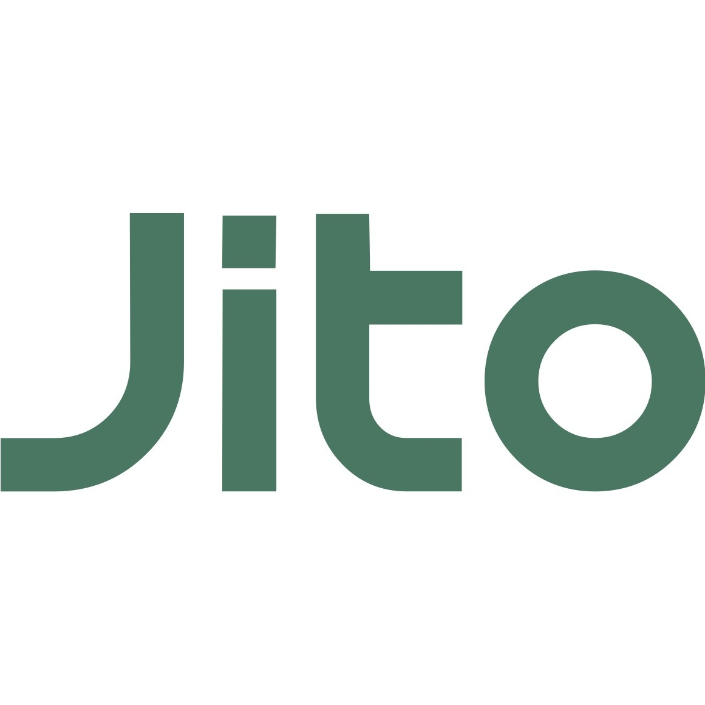

# Report Directory

 <strong>Jupiter</strong>

<ul>
<li><a href="https://github.com/OffsideLabs/reports/blob/public/audits/Jupiter-Aggregator-Apr-2024-OffsideLabs.pdf">Aggregator — Apr 2024</a></li>
<li><a href="https://github.com/OffsideLabs/reports/blob/public/audits/Jupiter-AggregatorV6-Oct-2025-OffsideLabs.pdf">Aggregator V6 — Oct 2025</a></li>
<li><a href="https://github.com/OffsideLabs/reports/blob/public/audits/Jupiter-Lend-Oct-2025-OffsideLabs.pdf">Lend — Oct 2025</a></li>
<li><a href="https://github.com/OffsideLabs/reports/blob/public/audits/Jupiter-LimitOrderV2-Apr-2024-OffsideLabs.pdf">Limit Order V2 — Apr 2024</a></li>
<li><a href="https://github.com/OffsideLabs/reports/blob/public/audits/Jupiter-Perpetuals-Feb-2024-OffsideLabs.pdf">Perpetuals — Feb 2024</a></li>
<li><a href="https://github.com/OffsideLabs/reports/blob/public/audits/Jupiter-PerpetualsExchange-May-2025-OffsideLabs.pdf">Perpetuals Exchange — May 2025</a></li>
<li><a href="https://github.com/OffsideLabs/reports/blob/public/audits/Jupiter-RFQ-Nov-2024-OffsideLabs.pdf">RFQ — Nov 2024</a></li>
<li><a href="https://github.com/OffsideLabs/reports/blob/public/audits/JupiterLend-LiquidityLending-Aug-2025-OffsideLabs.pdf">Liquidity Lending — Aug 2025</a></li>
<li><a href="https://github.com/OffsideLabs/reports/blob/public/audits/JupiterLend-Vaults-Aug-2025-OffsideLabs.pdf">Vaults — Aug 2025</a></li>
<li><a href="https://github.com/OffsideLabs/reports/blob/public/audits/Raccoons-JupiterDAO-Mar-2024-OffsideLabs.pdf">Jupiter DAO — Mar 2024</a></li>
</ul>

 <strong>Kamino</strong>

<ul>
<li><a href="https://github.com/OffsideLabs/reports/blob/public/audits/Kamino-Farms-Dec-2023-OffsideLabs.pdf">Farms — Dec 2023</a></li>
<li><a href="https://github.com/OffsideLabs/reports/blob/public/audits/Kamino-LIMO-Nov-2024-OffsideLabs.pdf">LIMO — Nov 2024</a></li>
<li><a href="https://github.com/OffsideLabs/reports/blob/public/audits/Kamino-Scope-Dec-2023-OffsideLabs.pdf">Scope — Dec 2023</a></li>
<li><a href="https://github.com/OffsideLabs/reports/blob/public/audits/Kamino-UnstakingPool-Aug-2025-OffsideLabs.pdf">Unstaking Pool — Aug 2025</a></li>
<li><a href="https://github.com/OffsideLabs/reports/blob/public/audits/Kamino-Vault-April-2025-OffsideLabs.pdf">Vault — April 2025</a></li>
</ul>

 <strong>Meteora</strong>

<ul>
<li><a href="https://github.com/OffsideLabs/reports/blob/public/audits/Meteora-AlphaVault-May-2024-OffsideLabs.pdf">Alpha Vault — May 2024</a></li>
<li><a href="https://github.com/OffsideLabs/reports/blob/public/audits/Meteora-AlphaVault0.3.2-Nov-2024-OffsideLabs.pdf">Alpha Vault 0.3.2 — Nov 2024</a></li>
<li><a href="https://github.com/OffsideLabs/reports/blob/public/audits/Meteora-AlphaVault0.4.0-April-2025-OffsideLabs.pdf">Alpha Vault 0.4.0 — April 2025</a></li>
<li><a href="https://github.com/OffsideLabs/reports/blob/public/audits/Meteora-DAMMv2-0.1.5-Oct-2025-OffsideLabs.pdf">DAMM v2 0.1.5 — Oct 2025</a></li>
<li><a href="https://github.com/OffsideLabs/reports/blob/public/audits/Meteora-DAMMv2-Jun-2025-OffsideLabs.pdf">DAMM v2 — Jun 2025</a></li>
<li><a href="https://github.com/OffsideLabs/reports/blob/public/audits/Meteora-DLMM-Jan-2024-OffsideLabs.pdf">DLMM — Jan 2024</a></li>
<li><a href="https://github.com/OffsideLabs/reports/blob/public/audits/Meteora-DLMM0.10.0-Oct-2025-OffsideLabs.pdf">DLMM 0.10.0 — Oct 2025</a></li>
<li><a href="https://github.com/OffsideLabs/reports/blob/public/audits/Meteora-DLMM0.8.2-Nov-2024-OffsideLabs.pdf">DLMM 0.8.2 — Nov 2024</a></li>
<li><a href="https://github.com/OffsideLabs/reports/blob/public/audits/Meteora-DLMMToken2022-Mar-2025-OffsideLabs.pdf">DLMM Token 2022 — Mar 2025</a></li>
<li><a href="https://github.com/OffsideLabs/reports/blob/public/audits/Meteora-DynamicAMM-Sep-2024-OffsideLabs.pdf">Dynamic AMM — Sep 2024</a></li>
<li><a href="https://github.com/OffsideLabs/reports/blob/public/audits/Meteora-DynamicAMM0.5.2-Nov-2024-OffsideLabs.pdf">Dynamic AMM 0.5.2 — Nov 2024</a></li>
<li><a href="https://github.com/OffsideLabs/reports/blob/public/audits/Meteora-DynamicBondingCurve-April-2025-OffsideLabs.pdf">Dynamic Bonding Curve — April 2025</a></li>
<li><a href="https://github.com/OffsideLabs/reports/blob/public/audits/Meteora-DynamicBondingCurve0.1.6-Oct-2025-OffsideLabs.pdf">Dynamic Bonding Curve 0.1.6 — Oct 2025</a></li>
<li><a href="https://github.com/OffsideLabs/reports/blob/public/audits/Meteora-DynamicBondingCurve0.1.7-Oct-2025-OffsideLabs.pdf">Dynamic Bonding Curve 0.1.7 — Oct 2025</a></li>
<li><a href="https://github.com/OffsideLabs/reports/blob/public/audits/Meteora-DynamicVault-Nov-2025-OffsideLabs.pdf">Dynamic Vault — Nov 2025</a></li>
<li><a href="https://github.com/OffsideLabs/reports/blob/public/audits/Meteora-DynamicVault-Sep-2024-OffsideLabs.pdf">Dynamic Vault — Sep 2024</a></li>
<li><a href="https://github.com/OffsideLabs/reports/blob/public/audits/Meteora-LiquidityDistributor-Oct-2025-OffsideLabs.pdf">Liquidity Distributor — Oct 2025</a></li>
<li><a href="https://github.com/OffsideLabs/reports/blob/public/audits/Meteora-Presale-OffsideLabs.pdf">Presale — Oct 2025</a></li>
<li><a href="https://github.com/OffsideLabs/reports/blob/public/audits/Meteora-Presale0.1.1-Nov-2025-OffsideLabs.pdf">Presale 0.1.1 — Nov 2025</a></li>
<li><a href="https://github.com/OffsideLabs/reports/blob/public/audits/Meteora-StakeForFee-Oct-2024-OffsideLabs.pdf">Stake For Fee — Oct 2024</a></li>
<li><a href="https://github.com/OffsideLabs/reports/blob/public/audits/Meteora-ZAP-Oct-2025-OffsideLabs.pdf">ZAP — Oct 2025</a></li>
</ul>

 <strong>Jito</strong>

<ul>
<li><a href="https://github.com/OffsideLabs/reports/blob/public/audits/Jito-RestakingVault-Nov-2024-OffsideLabs.pdf">Restaking Vault — Nov 2024</a></li>
<li><a href="https://github.com/OffsideLabs/reports/blob/public/audits/Jito-StakeDepositInterceptor-Nov-2024-OffsideLabs.pdf">Stake Deposit Interceptor — Nov 2024</a></li>
<li><a href="https://github.com/OffsideLabs/reports/blob/public/audits/Jito-TipRouter-Jan-2025-OffsideLabs.pdf">Tip Router — Jan 2025</a></li>

<a href="https://github.com/OffsideLabs/reports/tree/public/audits">See all audits →</a>

